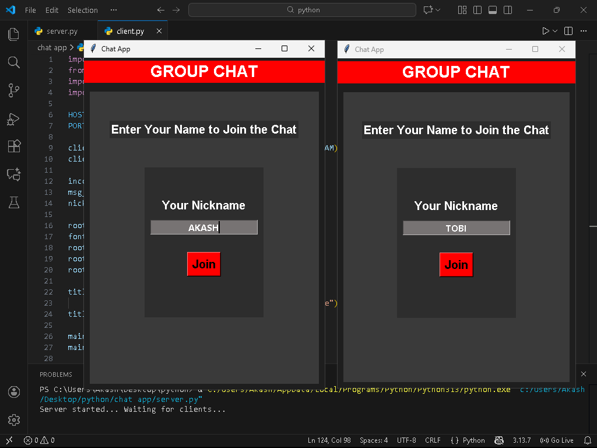
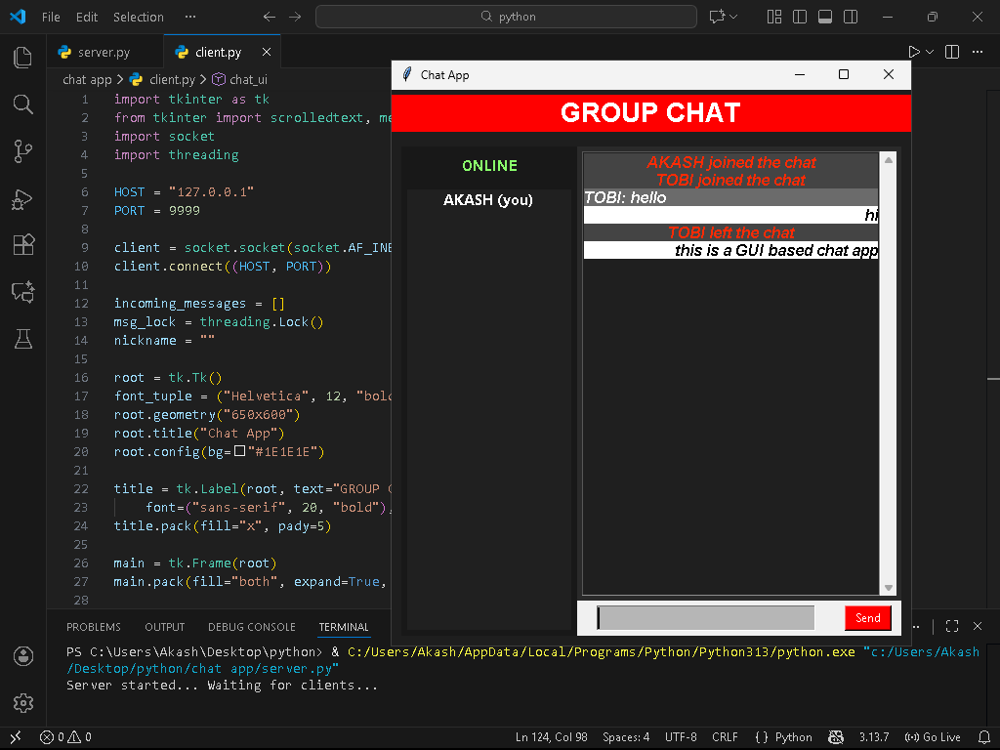

# 🗨 Tkinter GUI Group Chat Application

A Python-based real-time group chat app built using Tkinter (GUI), Sockets, and Multithreading.  
Multiple users can join the server with a nickname and chat inside a clean GUI interface.

---

## 🚀 Features

- Multi-user group chat  
- Nickname login screen  
- Smooth UI (thread-based — no lag)  
- Client–Server architecture  
- Join / Leave alerts  
- Online users panel  

---

## 🗂 Project Structure

chat-app/  
├── server.py   → Chat server  
├── client.py   → GUI chat client  
└── README.md  

---

## 🛠 Technologies Used

- Python 3.x  
- Tkinter  
- Socket Programming  
- Multithreading  

---

## ▶ How to Run

### 1️⃣ Start the Server
python server.py

### 2️⃣ Start the Client (open multiple windows if needed)
python client.py

### 3️⃣ Enter a nickname → Join → Start chatting 🎉

---

## 🖼 Screenshots

> Add your images inside a folder named screenshots/  
> Then rename them like below and they will display automatically.

---

## 💡 Future Improvements

- Direct messages (DM)  
- File sharing  
- Message timestamps  
- Emoji support  
- LAN / Internet mode  

---

## 🏆 Author

Developed by *Tobi*  
Contributions & improvements are welcome 🤝

---

## ⭐ Support

If this project helped you, please ⭐ star the repo!
